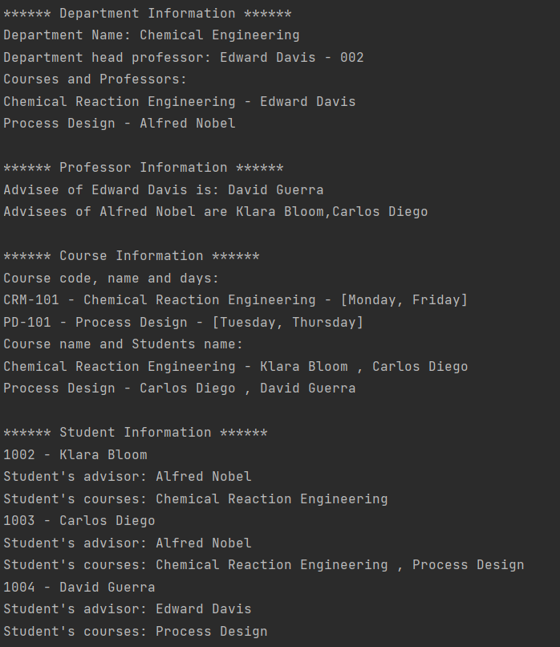

# Class and Object Practices

### This repository is created to improve my knowledge about object-oriented programming..

---

## Details

* This repository has
    * an example01 package which has Course.java, Department.java, Professor.java, Student.java and Main.java classes.
      A university-student-teacher system was simulated by establishing various relations with the objects between these classes.

    
  

---

## Installation

Clone the project.
> https://github.com/aslihanhasar/class-object-practices.git

---

## Usage

After cloning the project, open it with the ide you used.

---

## Requirements

* JDK (version 17 is recommended)

---

## Author

**Aslıhan Hasar**

* GitHub: [aslihanhasar](https://github.com/aslihanhasar)
* LinkedIn: [aslıhanhasar](https://www.linkedin.com/in/asl%C4%B1hanhasar
  )

---

## Contributing

Contributions, issues, and feature requests are welcome.

---

## License

[MIT](https://choosealicense.com/licenses/mit/)

---

## Show Your Suport

Give me a &#11088; if you like the project.

---

## Acknowledgments

* This repo is created for assignments in Introduction to Object-Oriented Programming with Java course given by Akın
  Kaldıroğlu at Udemy.